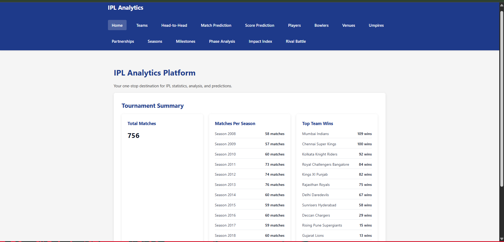
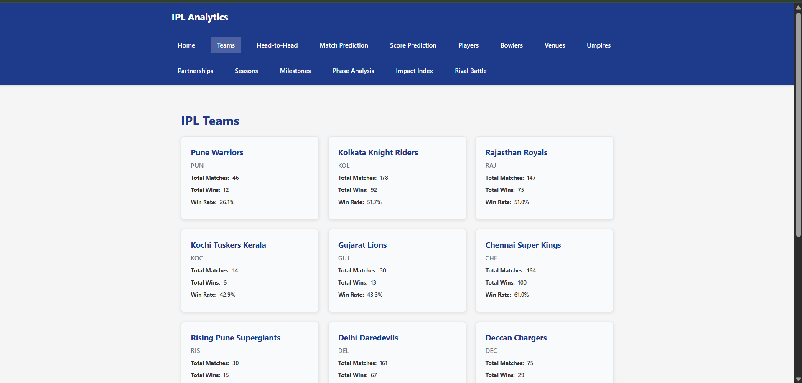
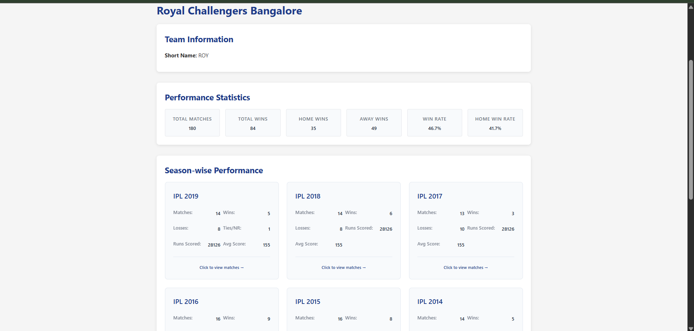
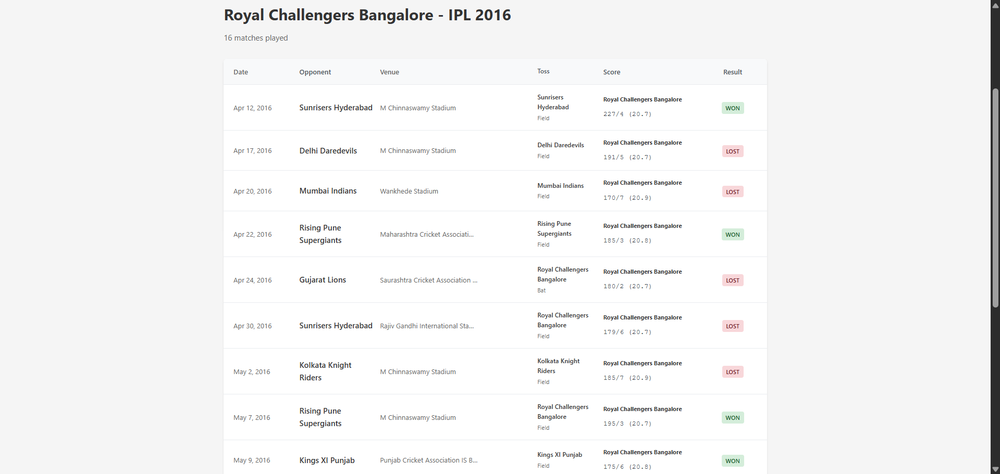
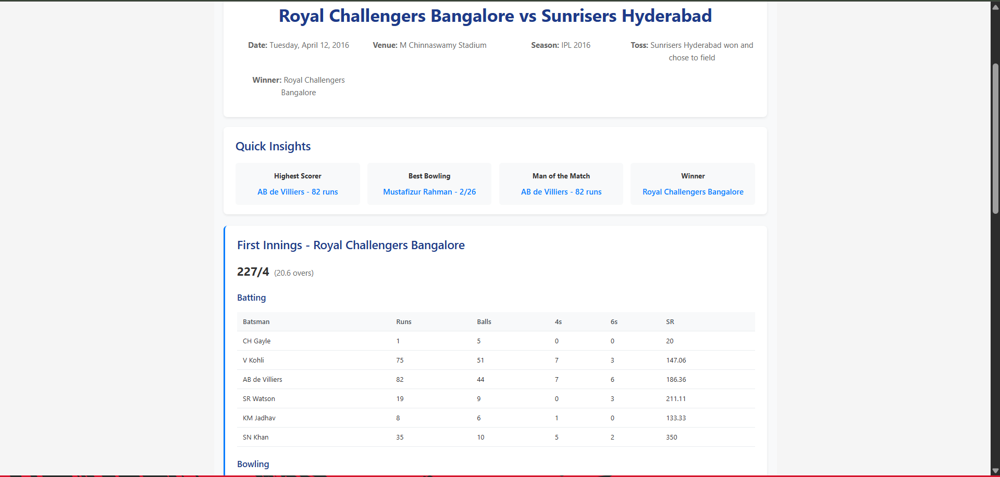
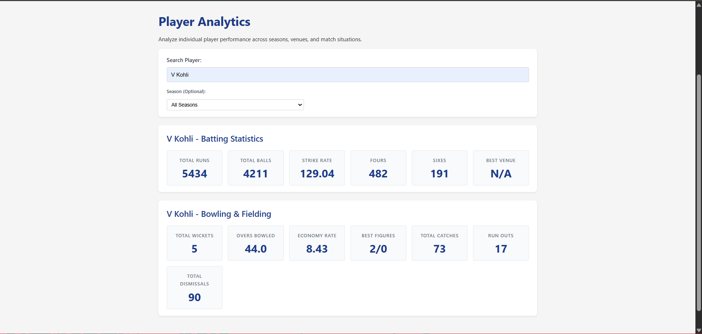
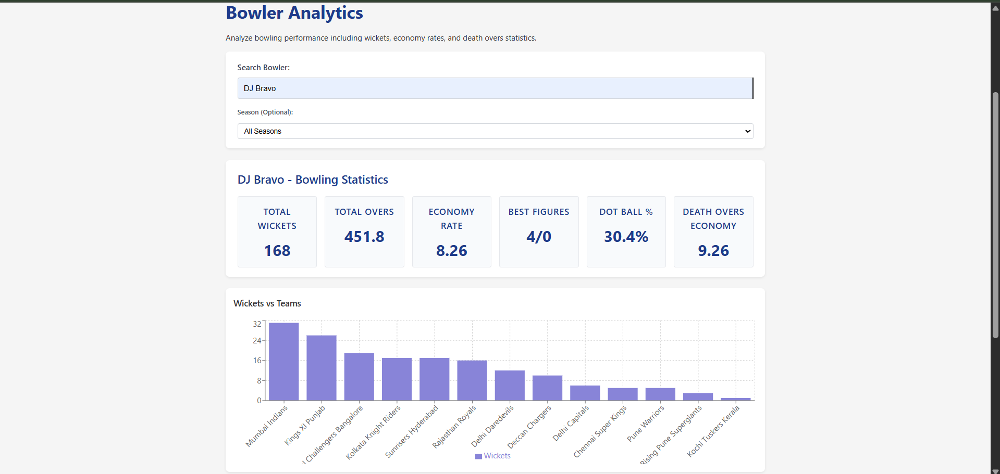
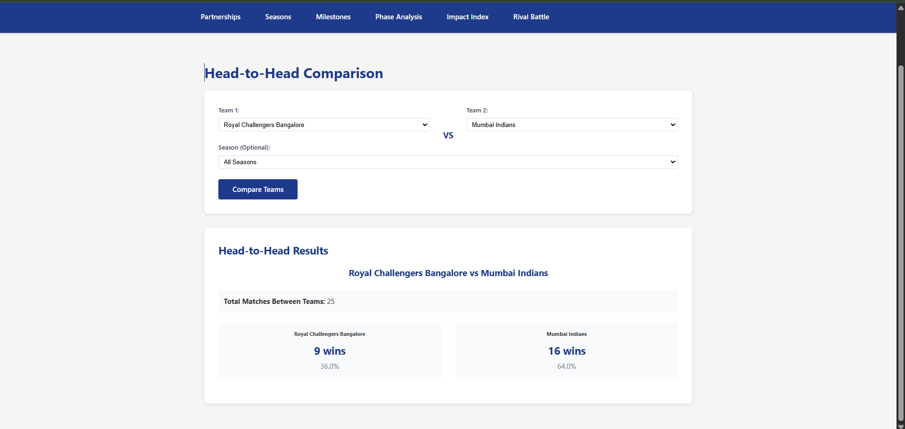

# IPL Analytics Platform  
Full-Stack MERN + FastAPI ML + Advanced Cricket Analytics (2008–2019)

A complete IPL analytics platform combining React, Express, MongoDB, and FastAPI Machine Learning.  
It provides deep statistical insights, match breakdowns, ball-by-ball exploration, and ML-powered predictions for all IPL seasons from 2008–2019.

## 📸 Screenshots

### 🏠 Home Dashboard

### 🧩 Teams Overview

### 📅 Season-wise Performance

### 🔍 Match List (Season View)

### 📝 Match Summary

### 📊 Player Analytics

### 🎯 Bowler Analytics

### ⚔️ Head-to-Head Comparison

### 🏟️ Venue Analytics

--------------------------------------------------------------------------------
EXTENSIBLE MODULAR STRUCTURE FOR NEW ANALYTICS MODULES
--------------------------------------------------------------------------------

PROJECT STRUCTURE
IPL/
  backend/        Node/Express REST API + MongoDB models
  client/         React frontend (Vite)
  ml-service/     FastAPI ML microservice
  data/           CSV/XLSX IPL data (2008–2019)
  docs/           Documentation + API references
  README.md
  .gitignore

--------------------------------------------------------------------------------
ARCHITECTURE OVERVIEW
--------------------------------------------------------------------------------

                 IPL Analytics Platform Architecture

                  +------------------------+
                  |        React UI        |
                  |    (Frontend, Vite)    |
                  +-----------+------------+
                              |
                              | API Calls
                              v
      +---------------------------------------------------+
      |                 Node.js Backend                   |
      |         Express API + MongoDB (Mongoose)          |
      +-----------+------------------------+---------------+
                  |                        |
                  | Database Access        | ML Requests
                  v                        v
      +---------------------------------------------------+
      |               FastAPI ML Microservice             |
      |       - Match Winner Model (Classification)       |
      |       - Score Prediction Model (Regression)       |
      +---------------------------------------------------+

React ↔ Backend for analytics and match data  
Backend ↔ ML Service for predictions  
Backend ↔ MongoDB for structured IPL stats  
React ↔ ML Service (optional) for live simulation tools  

--------------------------------------------------------------------------------
TECH STACK
--------------------------------------------------------------------------------

Frontend:
  - React (Vite)
  - Axios
  - Recharts (visualizations)

Backend:
  - Node.js + Express
  - MongoDB + Mongoose
  - CSV ingestion + ETL scripts

Machine Learning:
  - FastAPI + Uvicorn
  - scikit-learn
  - pandas / numpy
  - Joblib (model persistence)

--------------------------------------------------------------------------------
MAIN FEATURES
--------------------------------------------------------------------------------

HOME DASHBOARD
  - Tournament summary  
  - Matches per season  
  - Wins per team  

TEAMS ANALYTICS
  - Team profile  
  - Season-by-season breakdown  
  - Team → Season → Match → Over → Ball drilldown  

PLAYER ANALYTICS
  - Batting & bowling overview  
  - Season performance  
  - Strike rate trends  
  - Bowler difficulty metrics  

BOWLER ANALYTICS
  - Economy  
  - Wickets per phase  
  - Venue performance  

VENUE ANALYTICS
  - Average 1st innings score  
  - Toss impact  
  - Best teams and players  

HEAD-TO-HEAD
  - Rivalry overview  
  - Season filter  
  - Win/loss breakdown  

MATCH DETAILS
  - Full match scorecard  
  - Fall of wickets  
  - Partnerships  
  - Manhattan & Worm graphs  
  - Over-by-over analytics  

ADVANCED ANALYTICS
  - Phase Analysis (PP/Middle/Death)
  - Impact Index Scoring Engine
  - Rival Battle (Batsman vs Bowler)
  - Over aggregation APIs  

MACHINE LEARNING MODELS
  - Match Winner Prediction  
  - Score Prediction (First Innings)  

--------------------------------------------------------------------------------
INSTALLATION & SETUP
--------------------------------------------------------------------------------

You must run **all three services**: backend, ML service, frontend.

1) BACKEND SETUP (Node.js + Express)

  cd IPL/backend
  npm install

Create .env (optional):

  PORT=5000
  MONGO_URI=mongodb://localhost:27017/ipl

Import data (FIRST TIME ONLY):

  $env:IMPORT_CLEAR="true"
  npm run import:data

Run backend:

  npm run dev

Backend URL:
  http://localhost:5000/api

2) ML SERVICE SETUP (FastAPI)

  cd IPL/ml-service
  python -m venv .venv
  .venv\Scripts\activate
  pip install -r requirements.txt

Run ML API:

  uvicorn app.main:app --host 0.0.0.0 --port 8000

ML URL:
  http://localhost:8000/ml/...

3) FRONTEND SETUP (React + Vite)

  cd IPL/client
  npm install
  npm start

Frontend URL:
  http://localhost:3000

--------------------------------------------------------------------------------
RUNNING EVERYTHING TOGETHER
--------------------------------------------------------------------------------

1. Start MongoDB  
2. Start Backend  
3. Start ML Service  
4. Start Frontend  

Open browser → http://localhost:3000

--------------------------------------------------------------------------------
DATASET DETAILS
--------------------------------------------------------------------------------

Includes IPL seasons 2008–2019:

  matches.csv
  deliveries.csv
  players.xlsx
  teams.csv
  most_runs_average_strikerate.csv
  teamwise_home_away.csv

Used for:
  - Team analytics
  - Player analytics
  - Venue scoring patterns
  - Match timelines
  - Phase analysis
  - Rival battles
  - Machine learning model features

--------------------------------------------------------------------------------
API SUMMARY
--------------------------------------------------------------------------------

BACKEND /api ROUTES

  /teams                               → All teams
  /teams/:name                         → Team details
  /teams/:name/seasons                 → Season-level stats
  /teams/:name/seasons/:season/matches → Matches for team in season
  /matches/:matchId                    → Full match details
  /matches/:matchId/overs              → Over-by-over breakdown
  /analytics/phase                     → Phase analytics
  /analytics/impact                    → Impact Index
  /analytics/rival                     → Batsman vs bowler rivalry
  /analytics/venues/:venue/metrics     → Venue analytics

ML SERVICE /ml ROUTES

  /ml/predict/match-winner   → Match winner prediction
  /ml/predict/score          → First innings score prediction
  /ml/predict/live           → Optional real-time simulator

--------------------------------------------------------------------------------
NOTES
--------------------------------------------------------------------------------

- Designed specifically for IPL 2008–2019.  
- Update API URLs in frontend for production deployment.  
- For deployment:
    - Use hosted MongoDB  
    - Serve React build with Node/Nginx  
    - Deploy backend + ML separately  

--------------------------------------------------------------------------------
SUMMARY
--------------------------------------------------------------------------------

This system demonstrates:

  - Full-stack engineering (React + Node + MongoDB)
  - Production-level API design
  - Real-world data processing (ETL on IPL datasets)
  - Machine learning integration via FastAPI
  - Advanced sports analytics and visualization
  - Highly modular architecture suitable for extension

